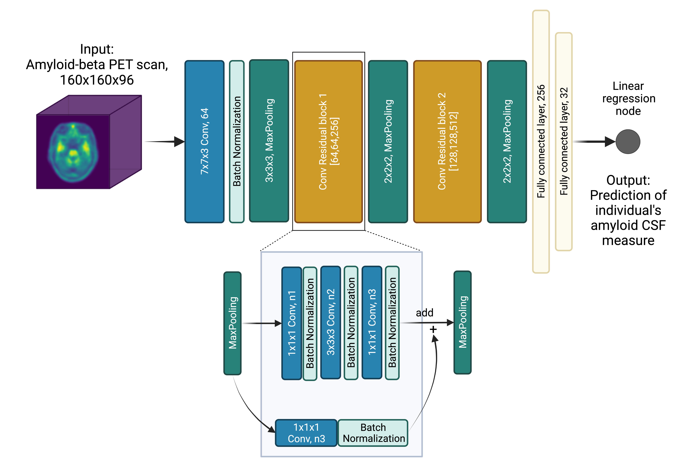

# ArcheD
Amyloid-beta aggregation is one of the Alzheimer's disease (AD) specific biomarkers. Its detection and measurement is a key factor for early identification and diagnosis of AD. We developed a novel residual neural network ("ArcheD") to predict amyloid-beta cerebrospinal fluid (CSF) concentration directly from amyloid-beta PET scans, independent of the tracer, brain reference region or preselected regions of interest. 
# About the model
ArcheD contains 35 layers and approximately 10.7 millions of parameters. 

Input: Amyloid PET scans with dimensions 160x160x96 ([same to CO-REG, AVG, STANDARDIZED IMAGE AND VOXEL SIZE processing step of ADNI dataset](https://adni.loni.usc.edu/methods/pet-analysis-method/pet-analysis/))

Activation function: ReLU

Optimization: Adam optimization algorithm (Kingma & Ba, 2014) with an initial learning rate of 0.0001

Evaluation metrics: mean squared error (MSE)

Number of epochs: maximum of 150 epochs and stopped early, if loss in the validation dataset did not decrease for 15 epochs 

Batch size: 4

For increasing the training set size we used augmentation approach. We applied either gaussian noise (σ=0,5,10,15,20,25%) or flipped images by X or Y axes with equal probability.




# How to use the model
1. Clone ArcheD repository from Github.
2. **In the folder 'model_to_use'** unzip the file model.zip.
3. Run `pip install arched_package.zip`
4. Now you can run ArcheD model with your command line.

```  
arched [-h] [--output_name OUTPUT_NAME] path_to_directory folder_with_scans

 A novel residual neural network for predicting amyloid CSF directly from amyloid PET scans

 positional arguments:
  path_to_directory     the path to folder that contains model (model_08-0.12_20_10_22.h5), arched_package.zip and folder with PET scans, for ex. '~/(your path)/model_to_use/'
  folder_with_scans     the name of the folder with scans (if the folder with scans is in path_to_directory) or the full path to it, for ex. 'scans' (as it locates in model_to_use folder) or '~/(your path)/scans'

 optional arguments:
  -h, --help            show this help message and exit
  --output_name OUTPUT_NAME, -o OUTPUT_NAME
                        name for the output file, for ex. 'arched_amyloid_csf_prediction'. Note: include the path if you want the output file to be saved not in the path_to_directory.
```

Example of the command line

`arched '~/model_to_use/' 'scans' -o 'arched_amyloid_csf_prediction'` 

5. If the model runs successfully, you will get the 'Model run successfully!' message and the CSV file will appear in your working directory. The file name will consist of the 'output_name', time and date of the model running.

# Authors
Arina A. Tagmazian, Claudia Schwarz, Catharina Lange, Esa Pitkänen, Eero Vuoksimaa

Data used for training and evaluation the model were obtained from the Alzheimer’s Disease Neuroimaging Initiative (ADNI) database (adni.loni.usc.edu). 

Preprint of the manuscript with results is available on [BioRxiv](https://www.biorxiv.org/content/10.1101/2023.06.20.545686v2). 
